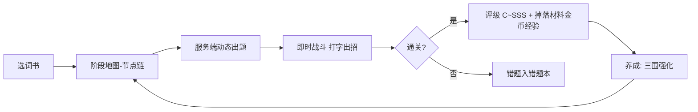

# 单词之旅 v1 项目计划

> [!note] 一句话
> PC 端浏览器 Web 应用：以[[即时战斗机制|即时战斗打怪]]包装[[词汇学习机制|打字背词]]，通过闯关、连击、评级、养成构成游戏化闭环。

## 项目概览

| 维度 | 内容 |
|---|---|
| 定位 | 背单词游戏，参考句乐部打字填充玩法 + 闯关打怪 |
| 平台 | PC 浏览器 Web 应用（预留 Electron/Tauri 打包，v1.1） |
| 词书 | 考研英一（先行）→ 英二、六级（v1.1） |
| 模式 | 中译英（标准 / 🔊）· 听写（噩梦 / 仅读音） |
| 风格 | 深色霓虹几何：暗紫/藏蓝底 + 发光描边 + 粒子 |



---

## 技术栈

> [!important] 核心决策
> **混合渲染**：React DOM 负责打字输入，Phaser 3 负责实时战斗与特效层，二者经 Zustand 单向同步。
> **出题服务端化**：抽词 / 义项轮换 / 易混补抽 / 挖空模板全部在服务端计算，客户端仅回显与提交。

| 层 | 选型 |
|---|---|
| 前端 | React 19 + TypeScript + Vite + Tailwind CSS |
| 服务端数据 | TanStack Query + React Router |
| 游戏层 | Phaser 3（主循环：怪物移动/AI/HP/粒子/飘字/眩晕） |
| 状态 | Zustand（React ↔ Phaser 单一状态源，单向广播） |
| 语音 | TtsProvider 抽象（Web Speech API 实现，预留 Edge-TTS 实现） |
| 音效 | Web Audio 程序生成（命中/暴击/受击/眩晕/过关） |
| 美术 | Phaser Graphics 程序绘制几何图形，零美术依赖 |
| 后端 | NestJS + Prisma + JWT（自动 Swagger） |
| 数据库 | MySQL 8.0，新库 `word_journey` |
| 测试/部署 | Jest 单测 + Docker Compose + CI（GitHub Actions） |

> [!tip] 后端为何选 NestJS
> 模块化 + DI，多词书 + 用户 + 会话 + 养成结构清晰；底层即 Express 性能够用；未来排行榜 / PK 可上 WebSocket。

---

### 语音服务抽象（TtsProvider）

> [!warning] 听写模式的可靠性底座
> 听写（仅读音）模式完全依赖 TTS，必须抽象成可替换实现，否则整个模式崩在系统语音上。

- 接口：`listVoices() / speak(text, opts) / stop()`
  - 实现一：Web Speech API（默认，零素材）
  - 实现二：Edge-TTS 远程（v1.1 可通过配置切换，接口不变，不侵入业务层）
- **语音可用性探测**：登录 / 选模式前检测是否存在可用英文语音；缺失时提示并禁用听写入口，中译英模式不受影响
- **autoplay 手势处理**：浏览器要求用户手势后才允许播放；听写题面提供「🔊 重播」大按钮，点击题目区任意处也可重放，两者同时充当手势激活
- 播放完成回调后才开始该题计时；重放防抖，连点不叠加

---

### Phaser × React 协作规范

> [!important] 防止双挂载与性能抖动
> React 19 StrictMode 会双挂载组件，Phaser 实例必须生命周期幂等；游戏主循环内禁止直接订阅 Zustand。

- Phaser 实例由 `useRef` 持有，`init / destroy` 幂等，StrictMode 双挂载安全
- 状态流向单向广播：**打字输入 → dispatcher → Zustand → Phaser Events**；Phaser 内部战斗状态由主循环私有持有，每帧结束仅快照低频字段（HP/评级/得分）回 React
- 粒子 / glow 特效按「特效等级」设置分档，低档关闭合成光晕，保证低配机帧率
- 类型共享：游戏事件 / 题面协议 TS 类型统一放 `packages/shared`

---

## 词汇学习机制

> [!todo] 词库构建基线
> - [x] 导入开放词库（考研英一约 5500 词，含释义/例句/音标）作为私有词库底座
> - [ ] 词条管理端：批量导入导出 + 编辑界面
> - [x] 词库质量校验脚本（导入后必跑）：重复词 / 缺音标 / 例句缺词干 / 标点异常
> - [x] **易混词对算法候选**（`word_pairs` 落库 3845 对）：形近（编辑距离≤2 + 长度差≤2 + 去词族变体，3779 对）∪ 音近（音标归一后同形，66 对）
> - [ ] AI 标注管线（v1.1）：补全一词多义、义近词对、例句、词根词缀（人工复核）

### 多维度难度分区

| 维度 | 说明 |
|---|---|
| 一词多义度 | 义项数、熟词僻义（如 `figure` 3+ 义） |
| 拼写复杂度 | 字母长度 + 不规则拼写（双字母/不发音字母/不规则词尾） |
| 易混淆度 | 形近（`principal/principle`）/ 音近（`cite/site`）/ 义近 词对数量 |
| 词频 + 考纲 | 高频基础 → 超纲 |

> 每个词综合计算 `difficulty_score` → 归一 0~1 → **tier Ⅰ基础/Ⅱ核心/Ⅲ拔高/Ⅳ超纲**，留存子分标签（长难词/多义词/易混词），权重可配置。此评估即[[成长系统#统一难度源|统一难度源]]。

### 阶段与词池映射

> [!important] tier → 阶段的落地方案
> 地图节点 = 难度阶段，stage 与 tier 的对应关系、词池规模、空池兜底在此明确。

- 每词书按 tier 从低到高切分为多个 stage：stage N 主池 = 对应 tier 词，**相邻 stage 词池重叠 20%** 承接难度过渡
- 词池下限 30 词；不足 30 时并入上一 stage；词池 < 10 不开新 stage
- 阶段解锁条件：上一 stage 通关评级 ≥ C
- **开局空池兜底**：早期无到期复习 / 错题词时，60:25:15 的比例缺额由「词池内未学词」补足，各池就绪后自动回归正常比例
- 重打同一 stage 会换词（动态生成，不固定选取）

### 动态关卡生成（不固定选取）

- 地图节点 = **难度阶段**（阶段 N 对应 tier 递增），取代固定单元词表
- 每次进关动态抽词：**新词 : 到期复习 : 错题生词 = 60 : 25 : 15**（可配置）
  - 新词：从该阶段词池按难度 + 记忆排程未学优先抽取
  - 复习词：SRS `next_review_at` 到期自动掺入（词级与义项级排程联动）
  - 错题/生词：错题本高频错词、生词本词掺入
- 关内题目按难度升序排列，**Boss 段 = 该批最难词**；重打同一阶段会换词

### 一词多义 · 义项轮换

> [!important] 已确认机制（义项级 SRS）
> 多义词逐义项记录独立例句。出题按 **`user_sense_progress` 义项级排程轮换**：优先近期未用 / 曾答错的义项，题面显示该义项中文 + 对应例句语境，挖空填词。多次复习覆盖全部义项，多渠道记忆锚点。

- 义项轮换为服务端纯函数模块，输入（词 + 各义项排程状态）→ 输出（本次出题义项），配单测
- 多义度高者多次复习后可出 **义项匹配卡**（Boss 段，该词 + 四宫格选义项/例句）

### 易混淆 · 同关对比

> 以 `word_pairs` 表为主键双向引用（正向 + 反向都从该表查）。抽到易混词则同关补抽其对比词，排序相邻 / 同段呈现，题面互带区分注释（`principal 校长 ≠ principle 原则`）+「注意区分」标识。

### SRS 间隔复习

- `review_stage / next_review_at / ease` 三字段排程
- **词级**（`user_word_progress`）与**义项级**（`user_sense_progress`）双粒度：词级管"是否掌握 / 掌握度"，义项级管"下一题出哪个义项"
- 到期自动掺入关卡；错题/生词本独立入口；复习词答对同样给经验与材料（复习闭环养成分）

---

## 出题契约（服务端）

> [!important] 核心接口
> 出题在服务端，客户端只做回显与提交。义项轮换 / 易混补抽 / 挖空模板 / SRS 掺入全部在服务端跑，动态因子与反作弊留有余地。

| 接口 | 请求 | 响应要点 |
|---|---|---|
| `POST /sessions` | `{ bank_id, stage_id, mode, count? }` | `{ session_id, questions: [{ seq, word_id, sense_idx, prompt, template, blanks, note, tier }] }` |
| `POST /sessions/:id/submit` | `{ seq, answer }` | `{ correct, correct_answer, dmg, combo_at, new_rating? }` |
| `POST /sessions/:id/finish` | `{ rating, hp_left }` | `{ xp, coins, drops, progress_delta }`（结算 + 落库） |

- 题面协议 / 游戏事件 TS 类型入 `packages/shared`
- 抽词、义项轮换、易混补抽、挖空、Boss 连对判定均为**纯函数模块**，可脱离 HTTP 单测
- 断线/中途退出：客户端静默重试提交；服务端保证幂等（session 维度）

---

## 即时战斗机制

### 场景设定

- 上下分栏：上 80% Phaser 战场 + 下 20% 固定四行打字区（视觉见[[UI设计#战斗主界面|战斗主界面]]）
- 角色固定右侧（金色矩形），小怪自左侧刷新、缓慢逼近

### 核心循环

```
场上同时存在小怪(上限3~5只, 自动补位) ← 逼近 → 角色
答对 → 释放攻击 → 命中"最近的小怪" → 扣血/Perfect加成
答错 → 扣血 + 不出招（红闪提示）
连续错 2 次 → 眩晕 1 回合：禁答 + 展示答案 + 怪集体逼近
小怪抵达身侧 → 攻击扣血后消失（漏怪惩罚）
```

### 怪物设计

| 几何形 | 属性 | 颜色 |
|---|---|---|
| 角色 | 固定右侧 | 金色 |
| 小怪-三角 | 脆快 | 红 |
| 小怪-方块 | 肉慢 | 紫 |
| 小怪-圆 | 普通 | 青 |
| 精英-星形 | 高伤 | 橙 |
| Boss | 大号多边形 + 独立血条 | 首领色 |

### Boss 战

> 连对击破 N 段血：需连续答对 N 题清空；中途答错 → Boss 反击扣血 + 血回退一段 + 连击打断（与连击系统强耦合）。连对判定基于 `learning_session_items` 逐题记录。

### 双模式难度

| 模式 | 提示 | 参数倾向 |
|---|---|---|
| 中译英（标准） | 中文 + 🔊读音 / 音标 | 怪逼近慢、我方血厚 |
| 听写（噩梦） | 仅 🔊 读音，无文字 | 怪逼近快、我方血薄 |

> 所有战斗数值（逼近速度/HP/伤害/眩晕回合/Boss 段数）做成可配置文件，便于调难度。

### 战斗体验规则

- **眩晕回合内怪物暂停逼近**：禁答 + 展示答案期间怪静止，解除眩晕后恢复移动（防止连坐崩盘）
- **输入容错**：首字母大小写自动容错（`Eiffel` / `eiffel` 均判对）；仅词库标注「首字母大写」的词强制大写
- **中途退出保留记录**：X 退出与结算均先静默后台提交本局对错，更新错题本 / 生词本，不弹阻断框
- 击杀/扣血/眩晕全部 Phaser 特效表现，不弹阻断对话框，打字不中断

---

## UI 设计

### 页面清单

| 页面 | 核心内容 |
|---|---|
| 登录/注册 | 徽章式标题 + 简洁表单 |
| 大厅 | 词书卡片（几何图标 + 进度 + 已掌握数 + 到期复习数 + 今日已学） |
| 单元阶段地图 | **节点链**，区分未解锁/可打/已通关（星级 C~SSS） |
| 战斗准备 | 选模式（中译英 🔊 / 听写 😈）+ 难度预览 + 语音可用性探测提示 + 出战 |
| **战斗主界面** | 见下 |
| 结算页 | 评级大字动画 + 统计 + 本局新增掌握/复习数 + **掉落材料展示动画** + 错题回顾 + 重试/下一关 |
| 养成页 | 等级条 + 三围面板 + 材料背包 + 强化 + "去哪刷材料"引导 |
| 词库浏览 | 按难度分区筛选，单独复习 |
| 设置 | 音量分项/特效/连击动画/字体/Boss 段数等数值调试 |

### 战斗主界面

```
┌─────────────────────────────────────────────────────────────┐
│ [X 退出] Unit 1·词库           [得分1200][⛭×5]          [≡设置] │
├─────────────────────────────────────────────────────────────┤
│    B O S S   ████████░░░░  (Boss血条, Boss战时出现)           │
│    ▲ ● ◆      逼近方向       ▰▱ 攻击特效                     │
│  小怪群 ─────────────→        [▣ 金色矩形·角色]              │
│   (场上3-5只自动补位)           ┌────┐                       │
│                                │HP██│ └ 我方血条             │
├─────────────────────────────────────────────────────────────┤
│ 🔊 问: 一天一苹果，医生远离我       [🔊 重播]                   │
│     An apple a day keeps the _ _ _ _ _ _ away.             │
│ 答: A n  a p p l e ... ▎                                     │
│ 音标:[ˈæpl] ▴已错1次 · 注意区分: principal≠principle      ⏎    │
├─────────────────────────────────────────────────────────────┤
│ ❤ HP ███████ │ 连击×5   评级 S                       [音量] │
└─────────────────────────────────────────────────────────────┘
```

### 打字区四行逻辑

1. **题目行**：中文 + 🔊（听写模式变为「📢 播放发音 + 🔊 重播」大按钮，无文字，点击题目区重放）
2. **挖空显示行**：英文句子已补字 + 下划线空格，随输入逐字点亮
3. **输入回显行**：实时回显，打错字即时红闪（不打断答题）
4. **辅助/快捷键行**：音标、答错次数、易混区分注释、快捷键（⌘M 掌握 / ⌘N 生词）

### 反馈设计原则

- 击杀/扣血/眩晕全部 Phaser 特效表现，**不弹阻断对话框**，打字不中断
- 眩晕：战场降透明 + 「眩晕中」大字 + 答案高亮，输入框置灰，怪物暂停
- 受击红闪 + 屏幕微抖；击杀爆炸粒子 + 飘字；高连击角色发光增强
- 结算评级 C→SSS 依次点亮动画

### 学习成效可视化

- 大厅词书卡片：已掌握 X / 总数、到期复习 Y、「今日已学」计数（数据源 `user_word_progress` 汇总 + 当日 `learning_sessions`）
- 结算页：追加本局新增掌握词数 / 复习词数，让用户每天看得到收益

---

## 成长系统

### 角色属性（三围）

| 属性 | 作用 | 对应材料 |
|---|---|---|
| 生命 HP | 承受答错/漏怪伤害（容错） | 生命精华 |
| 攻击力 | 每次答对伤害 → 减少击杀所需答对数（效率） | 力量碎片 |
| 防御 | 百分比减伤 | 守护结晶 |

> 材料分级 Ⅰ~Ⅳ；获取靠关卡掉落。

### 统一难度源

> [!important] 一个数据贯穿全场
> **单元（阶段）词汇难度综合评估** → 同时驱动：①怪物属性（词越难怪越强）②关卡难度 ③材料稀有度（Ⅰ→Ⅳ）。

- 静态：词长/词频/考纲/多义/易混综合分（seed 计算入库）
- 动态因子（v1.1）：全局/个人正确率反馈微调（依赖 `learning_session_items` 逐题数据）

### 角色等级

- 通关得经验升级 → 解锁属性强化上限 + 头像徽章
- 不做自由加点，属性统一靠材料强化

### 经济

- 强化消耗 = **对应材料 + 金币**（金币通关 / 评级获得）
- 掉落 = 难度定稀有、**评级定量**（C~SSS 数量系数，SSS 幸运掉落）；听写噩梦模式掉落加成
- MVP 即配全数值表（经验曲线 / 材料消耗 / 掉落系数），避免"刷爆"或"卡资源"

### 平衡护栏

> [!warning] 设计红线
> ①攻击力只影响击杀所需答对数且设下限 —— 任何怪至少 ≥2 次答对，Boss 仍需连对 N 段；
> ②防御只减固定百分比，扣血恒 > 0。
> → **数值碾压无法绕过"会单词"**，成长提升"容错 + 效率"，不替代记忆。

---

## 数据模型

```sql
-- word_banks         词书（kaoyan_engl1 先行 / kaoyan_engl2 / cet6，后两者 v1.1）
-- words              单词总表（跨词书共享）
--   + phonetic_en/am + collocations + etym
--   + synonyms/antonyms + difficulty_score / tier / difficulty_dimensions(JSON)
-- word_senses        义项表 (word_id, idx, meaning, example)
--   -- 义项轮换 / 义项匹配卡的题面来源；多义词逐义项独立例句
-- word_pairs         易混淆对比组 (word_a, word_b, type: 形近/音近/义近, note)
--   -- 主键双向引用，同关补抽的正/反向都查此表
-- bank_words         词书↔单词(排序 = 阶段分组)
-- users              (+coins, password_hash)
-- user_word_progress (stage/对错次数/wrongbook/vocabbook/掌握度
--                     review_stage/next_review_at/ease)   -- 词级汇总
-- user_sense_progress (user_id, word_id, sense_idx
--                     review_stage/next_review_at/ease/correct_count)  -- 义项级排程
-- user_character     (level/exp/hp_lv/atk_lv/def_lv)
-- materials          (code, tier Ⅰ~Ⅳ, name)
-- user_materials     (user_id, material_id, count)
-- learning_sessions  (result/monsters_cleared/boss_cleared/
--                     damage_taken/stun_count/max_combo/rating)
-- learning_session_items (session_id, seq, word_id, sense_idx, type,
--                     answered/correct/elapsed_ms/combo_at/dmg)   -- 逐题记录
-- 配置表: monster_base_config / drop_config / level_gen_config
```

---

## 部署与测试

### 部署

- 本地 / 演示：Docker Compose（`api` + `mysql`），`web` 静态产物经 Nginx 托管
- CI（GitHub Actions）：lint → typecheck → 单测 → 构建；合并后自动部署 API 与静态资源
- 环境变量管理：`.env` + 模板，密钥不入库

### 测试策略

| 类型 | 范围 |
|---|---|
| 纯函数单测 | 抽词比例（60:25:15）、义项轮换、易混补抽、挖空模板、Boss 连对判定、评级计算、掉落计算 |
| 词库质量校验 | 重复词 / 缺音标 / 例句缺词干 / 标点异常（导入管线必跑，可并入 CI） |
| 接口契约测试 | 出题 / 提交 / 结算接口的请求响应契约（`packages/shared` 类型为准） |
| E2E（v1.1） | Playwright：登录→选词书→战斗→结算 冒烟路径 |

### 安全基线

- 密码 bcrypt/argon2 哈希存储；JWT access(15m) + refresh(7d) 轮换
- 所有写接口鉴权；`/sessions/:id/submit|finish` 校验会话归属当前用户
- 用户输入（题面仅服务端生成，客户端不拼 SQL / 模板）

---

## 目录结构

```
单词之旅/
  apps/
    web/        React + Vite + Phaser
    api/        NestJS + Prisma（auth / banks / questions / sessions）
  packages/
    shared/     前后端共享 TS 类型（API 契约 / 游戏事件 / 题面协议）
  db/
    schema.prisma
    seed/
    data/       词库 JSON 源数据
    pipeline/   难度评估、易混词对生成（generate-pairs.ts）与 AI 标注（v1.1）
```

---

## MVP 范围

> [!important] MVP = 英一 + 完整主闭环
> 义项级 SRS、服务端出题进 MVP；商店、多词书、AI 人工复核、排行榜、E2E 明确后置 v1.1。

- [x] 技术选型与设计闭环
- [ ] 词库 2a：英一 5500 词导入 + 质量校验 + 多维度难度分区（算法先行）
  - [x] 词库导入 + 质量校验脚本 + 形近/音近易混词对算法候选（word_pairs 3845 对，服务端出题时同关对比）
- [x] 后端：认证 / 词书与阶段 / 服务端出题契约 / 会话结算 / 进度·错题·生词 / 养成强化
  - [x] **认证**：注册/登录/refresh 轮换/me/角色初始化；bcryptjs 哈希、access(15m)+refresh(7d) 轮换（refresh 存哈希、旧 token 复用失效）、JwtAuthGuard
  - [x] **服务端出题契约**：`GET /questions/:bankCode/:stageId`
    - 按 tier→stage 词池 + userWordProgress 划分 新/复习/错题本 三源，`allocMix` 按 60:25:15 抽 30 题，空池兜底补新词
    - 中译英模式：中文释义为 prompt + 首字母挖空模板；听写模式：音标为 prompt + 首尾挖空
    - 易混补抽：word_pairs 反向建索引，命中则 note 提示「形近/音近（区分 xxx）」
    - 纯函数算法（question-builder.ts）15 用例单测；实测 30 题含易混对（injury↔injure 等）✓
  - [x] **词书与阶段**：`GET /banks`（大厅）+ `GET /banks/:code/stages`（阶段地图：tier/词数/解锁链/最佳评级）
  - [x] **会话结算闭环**：`POST /sessions`（落库会话+逐题）→ `POST /sessions/:id/submit`（校验归属 → 评级/经验/金币/掉落 → 词级+义项级 SRS → 角色 exp/材料）
    - settlement.ts 纯函数（评级 C~SSS / SM-2 简化排程 / 掉落概率）12 用例单测；端到端验证：评级 S、SRS 词级 29 对 1 错、义项级 30 条、越权提交 401 ✓
- [ ] 前端：登录 → 大厅 → 阶段地图 → 战斗准备 → 战斗 → 结算 → 养成 → 词库浏览 / 管理
  - [x] **前端外壳（milestone 5）**：API client（token+401 自动 refresh 重试）、认证 store（zustand 持久化）、路由守卫
  - [x] 页面：登录/注册 → 大厅（词书卡：总词/掌握/待复习/今日）→ 阶段地图（解锁链/最佳评级）→ 战斗（TypingCore 打字核心：挖空模板渲染+回车判定+结果收集）→ 结算（评级/经验/金币/掉落物）→ 养成（角色三围/等级）
  - [ ] 词库浏览 / 管理端（batch import/export + 编辑界面）
- [ ] 即时战斗：几何角色 / 多怪逼近补位 / Boss 连对击破 / 眩晕（怪暂停）/ 血条粒子飘字
- [x] 打字核心：四行答题区 + 中译英&听写双模式 + 义项轮换/易混对比出题 + SRS 掺入（词级+义项级）
  - [x] **义项轮换**：接入 user_sense_progress 真数据，`rotateSense` 均匀覆盖多义词各义项（未测义项 & 到期义项优先）
  - [x] **SRS 掺入复习池**：按 nextReviewAt 到期优先（dueFirst 排序 + pickReview 取已到期词）
  - [x] **双模式**：TtsProvider 抽象（Web Speech API）+ 语音可用性探测（缺失禁用听写入口）+ 听写音标 prompt/首尾挖空 + 🔊 重播（autoplay 手势）
  - [x] **易混对比同关**：会话内互为易混的词相邻排布（pairIndex 紧邻重排）
  - [x] 端到端验证：听写模式 27 题（g___e / 音标 ɡres / 24 题易混提示）+ submit 结算 ✓
- [ ] 结算评级 C~SSS + 掉落动画 + 音效 + 全量配置项
- [ ] 部署：Docker Compose + CI + 词库质量校验脚本 + 核心算法单测

### v1.1（明确后置）

- [ ] AI 标注管线（多义/易混/例句/词根词缀，人工复核）
- [ ] 多词书：英二、六级
- [ ] 商店、排行榜 / PK（WebSocket）
- [ ] 动态难度因子（个人正确率反馈）
- [ ] Edge-TTS 语音实现切换
- [ ] Tauri / Electron 桌面打包
- [ ] Playwright E2E 冒烟

---

## 里程碑

| # | 内容 |
|---|---|
| 1 | Monorepo 脚手架（apps/web + apps/api + packages/shared）+ MySQL 新建 `word_journey` 库 + Docker Compose + CI 骨架 |
| 2a | 词库导入 + 质量校验脚本 + 算法难度分区 + 形近/音近易混词对候选（word_pairs 3845 对，MVP 必须） |
| 2b | AI 标注管线（v1.1） |
| 3 | Prisma schema 全量（含义项/逐题表）+ seed |
| 4 | 后端 API（认证/词书阶段/服务端出题/会话结算/进度错题生词/养成强化）+ 核心算法纯函数单测（✅ 已完成并端到端验证） |
| 5 | 前端外壳：登录 → 大厅 → 阶段地图 → 战斗准备 → 结算 → 养成 → 词库浏览/管理（外壳完成 ✓，词库管理端待建） |
| 6 | Phaser 战斗层（几何角色/多怪逼近/Boss/眩晕怪暂停/血条/粒子/特效分档） |
| 7 | 打字核心 + 双模式 + 义项轮换/易混对比出题 + 词级/义项级 SRS 掺入 + 大小写容错 |
| 8 | 结算评级 + 掉落 + 音效 + 配置打磨 + 成效可视化 |

---

## 决策记录

> [!note] 已确认的关键决策
> - 混合渲染（DOM 打字 + Phaser 特效）；Phaser 实例 useRef + StrictMode 幂等；loop 不订阅 Zustand ✅
> - **出题服务端化**：抽词/义项轮换/易混补抽/挖空在服务端，协议类型入 shared ✅
> - 后端 NestJS；词库开放库底座 + 质量校验 + 标注管线（后置 v1.1）✅
> - 即时制多怪同场；答对攻击最近怪；答错扣血；连错 2 眩晕禁答且**怪暂停逼近** ✅
> - 小怪链 + Boss；Boss 连对击破 N 段（逐题记录支撑）✅
> - 几何霓虹美术；上下分栏；阶段地图节点链（tier→stage 映射 + 空池兜底）✅
> - 三围养成 + 材料金币 + 等级体系；难度驱动稀有度；MVP 即配全数值表 ✅
> - 动态关卡抽词 60:25:15；**义项级 SRS 进 MVP**（word_senses / user_sense_progress）；易混同关对比（word_pairs 双向）✅
> - **易混词对算法候选**：形近 = 编辑距离≤2 且长度差≤2，排除词族变体（派生/屈折，如 deliver↔delivery）；音近 = 发音表归一后一致；merges 后形近优先。已落库 `word_pairs`（3845 对）作为出题范围，义近与词根词缀标注仍留 AI 管线（v1.1）✅
> - TtsProvider 抽象 + 语音可用性探测 + 听写重播（满足 autoplay 手势）✅
> - **里程碑 4 后端已交付并端到端验证**：JWT 认证（bcryptjs + refresh 轮换）、词书/阶段地图、服务端出题（含易混补抽）、会话结算闭环（评级/经验/金币/掉落 + 词级与义项级 SRS）✅
> - 输入大小写容错；中途退出保留错题记录；学习成效可视化 ✅
> - v1.1：商店 / 多词书 / AI 人工复核 / 排行榜 / 动态难度因子 / Edge-TTS / 桌面打包 / E2E ✅
